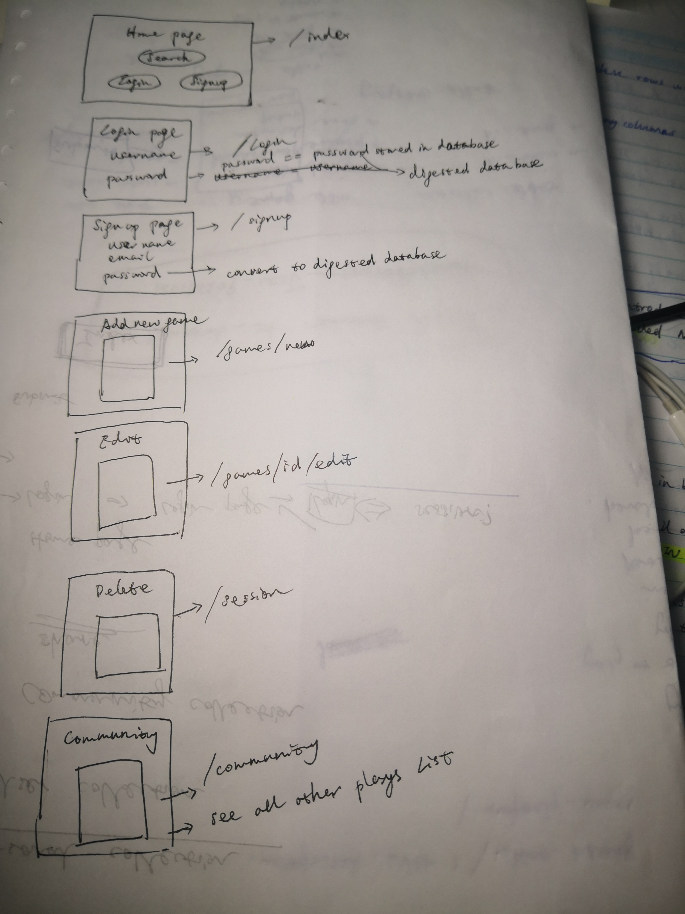

# Find-U-Game
[link](https://powerful-fortress-90037.herokuapp.com/)

## App Introduction

- This web app allows users to track their video game collection. 
- It allows users to create, read, update, and delete video games from their collection.
- Users are only allowed to edit games from their own inventory.
- It takes inspiration from Rawg.io and uses their API for finding information about games.
- In users backlog they can categorize games as playing, beaten, completed, watching and trade-off.

## App Develepment

- This app was made with CSS, HTML for the frontend, Ruby Sinatra and other gems library for the backend.
- It was deployed on Heroku

## The Appraches Taken:

- Draw a wireframe

- Draw a wireframe, think a route for each page.
- Write prints message in each section to check is the request got response.
- Read the error report, find the error based on the error message.
- Search error number on google to find answer.
- Do research for the new function, new method.

## Future Development:

- Learn how to css / html skill to make a game card, instead of table format
- Utilise SQL and other sinatra method to make dashboard
- Would like to make a feature, which can left message for users who like to trade-off their video games

